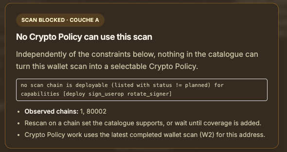
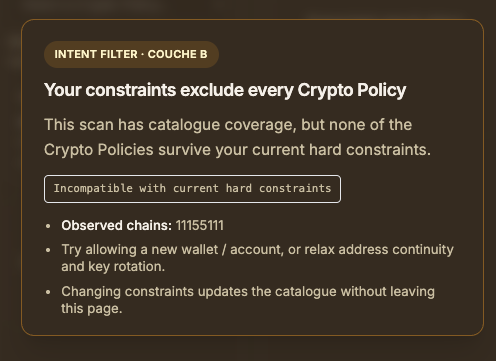
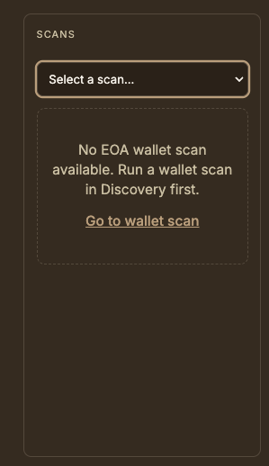

# CAFE User Guide

This guide explains how to use the CAFE frontend to discover, assess, and manage cryptographic risks for Ethereum wallets and TLS endpoints.

## Document versionning

- v0.11.0
  - Date: September 21st, 2026
  - Comments: **CFB-P8** — CPM catalog detail shows platform facts from CPM (compatible networks); the UI does not rely on a local provider mirror. See [ADR_20260918](https://github.com/create2-labs/cafe-adr/blob/main/ADR_20260918_cpm_catalog_facts_frontend_boundary.md).
- v0.10.0
  - Date: September 17th, 2026
  - Comments: Four-tab CPM Navigation (**Introduction** / **CPM catalog** / **Dashboard** / **Crypto Policy Mgt**); Discovery and CPM Introduction narratives (phase 1 observe vs phase 2 compose & persist; TLS informative only / no TLS remediation; CPM matches Crypto Policies it knows); US spelling **catalog**; new anchors `#cpm-catalog` and `#cpm-dashboard-scans`. Existing error anchors unchanged.
- v0.9.0
  - Date: September 16th, 2026
  - Comments: Reshape **Crypto Policy Management** for the three-tab shell (Introduction / Dashboard / Crypto Policy Mgt); jargon-free concepts (latest completed scan, stale vs latest scan, catalog match, hard constraints); stable deep-link anchors for SPA Learn more targets; representative UI screenshots under `images/` for the main gate cases. Internal nicknames (W2, couche A/B) are reserved for operator/developer notes — not the main task path.
- v0.8.0
  - Date: August 27th, 2026
  - Comments: Align CPM UX with ADR_20260824 — no server draft / Save draft / rebind; local composition (NB2); W2 scan anchoring; signed persist + NB1 replace. See [ADR_20260824_remove_cp_drafts](https://github.com/create2-labs/cafe-adr/blob/main/ADR_20260824_remove_cp_drafts.md) and [CP-PERSIST runbook](./docs/security/cp-persist-v1.md).
- v0.7.0
  - Date: August 22nd, 2026
  - Comments: Rewrite **Crypto Policy Management** for the two-layer model (ADR amendement): select Crypto Policy from catalogue → explore **scan-compatible** providers → validate **user constraints** explicitly → persist with `user_constraints`. No FE hard-coded Nicetry defaults; `key_rotation` lives in the constraints panel (not on explore re-request). See [ADR_20260803_cp_provider_abstraction](https://github.com/create2-labs/cafe-adr/blob/main/ADR_20260803_cp_provider_abstraction.md).
- v0.6.0
  - Date: August 18th, 2026
  - Comments: Update **Crypto Policy Management** section for Capability Provider model (ADR 2026-08): solution profile view replaces policy graph; `key_rotation_model` selector; `claim_status: declared` wording; soft findings acceptance before persist; `accepted_provider_snapshot` in persist payload. See [ADR_20260803_cp_provider_abstraction](https://github.com/create2-labs/cafe-adr/blob/main/ADR_20260803_cp_provider_abstraction.md).
- v0.5.0
  - Date: June 21st, 2026
  - Comments: Add **Crypto Policy Management** user guide aligned with CPM UI user stories **US1–US21** (graph workspace, persist without separate Validate, Discovery deep link, session resume, leave guard).
- v0.4.0
  - Date: June 21st, 2026
  - Comments: Document Platform Status version tiles including **CPM Version** (**CPM-UI-7A**).
- v0.3.0
  - Date: Feb 26th, 2026
  - Comments: Documentation review and version/date update.
- v0.2.0
  - Date: Feb 1st, 2026
  - Comments: Navigation and routes updated for new interface (Discovery tabs, Platform); anonymous mode clarified (view-only without account, sign-in required to run scans).
- v0.1.0
  - Date: Jan 19th, 2026
  - Author: Oleg Lodygensky
  - Comments: initial version

## Table of Contents

1. [Getting Started](#getting-started)
2. [Authentication](#authentication)
3. [Dashboard](#dashboard)
4. [Wallet Scanning](#wallet-scanning)
5. [TLS Endpoint Scanning](#tls-endpoint-scanning)
6. [Viewing Scan Results](#viewing-scan-results)
7. [Crypto Policy Management](#crypto-policy-management)
8. [Platform Status](#platform-status)
9. [Security Page](#security-page)
10. [Settings and Plans](#settings-and-plans)
11. [Wallet Management](#wallet-management)
12. [Anonymous Mode](#anonymous-mode)

## Getting Started

### Accessing CAFE

CAFE is accessible via a web browser.

### First Visit

When you first visit CAFE, you can:

- **Browse anonymously** — View default endpoints and scan results without creating an account; to run new scans you must sign in or sign up. Anonymous data are temporary and not persisted long-term.
- **Create an account** — Sign up to run scans and save your results; your scans are stored in the backend so you can retrieve them when you reconnect.
- **Sign in** — If you already have an account

### Navigation

The main navigation menu provides access to:

- **Home** — Landing page with links to Discovery, Crypto Policy Management, and Remediation
- **Discovery** — Tabbed section with:
  - **Introduction** — Phase 1 of crypto agility: observe wallets and TLS endpoints (read-only). Wallet scan interprets risk score and NIST level only — it does **not** choose a Crypto Policy. TLS scan is informative only; CAFE does not provide remediation for TLS endpoints.
  - **Dashboard** — Overview of your scans and security statistics
  - **Wallet scan** — View and manage wallet security scans
  - **TLS scan** — View and manage TLS endpoint security scans (informative only)
- **Crypto Policy Management** — Tabbed section with:
  - **Introduction** — Phase 2 of crypto agility: compose and persist a Crypto Policy from a completed Discovery wallet scan; how CPM matches scans to Crypto Policies it knows
  - **CPM catalog** — Browse system-available Crypto Policies (not your persisted inventory)
  - **Dashboard** — Your wallet scans with Crypto Policy status per scan (`persisted` / `candidate` / `N/A`)
  - **Crypto Policy Mgt** — Compose, explore catalog matches, and persist a recommended policy
- **Remediation** — Migration to post-quantum–resistant cryptography
- **Platform** — Sub-pages: **Status** (health, versions), **Security** (token inspection, refresh)
- **Networks (Chains)** — View supported blockchain networks
- **Settings** — Manage your profile and view plan information
- **Wallets** — Manage your saved wallets (requires authentication)

## Authentication

### Sign Up

To create a new account:

1. Click **Sign Up** in the navigation menu or on the sign-in page
2. Fill in the registration form:
   - **Email address** — Your email (used for login)
   - **Password** — Choose a strong password
   - **Confirm Password** — Re-enter your password
3. Complete the **Cloudflare Turnstile** verification (bot protection)
4. Click **Sign Up**

### Sign In

To sign in to your account:

1. Click **Sign In** in the navigation menu
2. Enter your **email address** and **password**
3. Complete the **Cloudflare Turnstile** verification
4. Click **Sign In**

After successful authentication, you'll receive a hybrid PQC JWT token (EdDSA + ML-DSA-65) that is automatically stored and used for subsequent API requests.

### Sign Out

To sign out:

1. Click on your profile/email in the navigation
2. Select **Sign Out**

Your session will be cleared and you'll be redirected to the sign-in page.

## Dashboard

The Discovery **Dashboard** (`/discovery/dashboard`) provides an overview of your security scanning activity and statistics.

### Overview Statistics

The dashboard displays four key metrics:

- **Total Scans** — Total number of scans performed (wallet + TLS)
- **High Risk** — Number of scans with high quantum risk
- **Medium Risk** — Number of scans with medium quantum risk
- **Safe** — Number of scans with low or no quantum risk

### Recent Scans

The dashboard shows your most recent scans, including:

- **Wallet scans** — Ethereum addresses scanned
- **TLS scans** — Endpoints scanned
- **Risk level** — Visual indicator (🔴 High, 🟡 Medium, 🟢 Safe)
- **Scan date** — When the scan was performed

### Quick Actions

From the dashboard, you can:

- **Start a new scan** — Click the "New Scan" button to scan a wallet or TLS endpoint
- **View scan details** — Click on any scan result to see detailed information
- **Filter scans** — Use the filters to find specific scans

## Wallet Scanning

A **wallet scan** is the first necessary step of crypto agility in CAFE: Discovery **observes** wallet posture so you can later **compose and persist** a Crypto Policy in Crypto Policy Management.

Discovery is **read-only** for wallets (blockchain explorers / on-chain data only). The only interpretation Discovery makes is the **risk score** and **NIST** security level. It does **not** conclude which Crypto Policy you should use — that match happens later in CPM.

CAFE can scan Ethereum wallets to assess their quantum vulnerability by checking if the public key has been exposed on-chain.

### Starting a Wallet Scan

1. Navigate to **Discovery → Dashboard** or **Discovery → Wallet scan**
2. Click the **"New Scan"** button (sign-in required if you are in anonymous mode)
3. In the scan modal:
   - Select **"Wallet Address"** as the scan type
   - Enter an Ethereum address (must start with `0x`)
   - Click **"Scan"**

### Understanding Wallet Scan Results

After scanning, you'll see one of three risk states:

#### 🔴 High Risk — Public Key Exposed

- **Meaning**: The wallet has executed at least one transaction
- **Risk**: The public key is permanently visible on the blockchain, making it vulnerable to future quantum attacks
- **Action**: Consider migrating to a quantum-safe Account Abstraction wallet (ERC-4337)

#### 🟡 Medium Risk — Public Key Not Exposed

- **Meaning**: The wallet has never executed a transaction
- **Risk**: While not immediately threatened, any future transaction would expose the public key
- **Action**: Consider creating a new quantum-safe wallet before first use

#### 🟢 Low Risk — CAFE Wallet Attached

- **Meaning**: The wallet is a CAFE-managed Account Abstraction wallet with PQC support
- **Risk**: Minimal — protected by post-quantum cryptography
- **Action**: Continue using this wallet for quantum-safe operations

### Multi-Chain Support

CAFE automatically scans wallets across multiple Ethereum-compatible chains:

- Ethereum Mainnet
- Arbitrum One
- Optimism
- Base
- Polygon
- And more...

The scan results show the risk status for each chain where the address has activity.

### Scan Details

Clicking on a scan result shows detailed information:

- **Address** — The Ethereum wallet address
- **Account Type** — EOA (Externally Owned Account) or AA (Account Abstraction)
- **Algorithm** — Cryptographic algorithm used (e.g., ECDSA-secp256k1)
- **NIST Security Level** — Quantum security level (1-5)
- **Key Exposed** — Whether the public key is visible on-chain
- **Risk Score** — Numerical risk assessment (0.0 to 1.0)
- **Networks** — Chains where the address has activity
- **CBOM** — Cryptographic Bill of Materials in CycloneDX format

## TLS Endpoint Scanning

A **TLS scan** analyses a TLS endpoint (for example RPC nodes, APIs, frontends). It checks TLS version, cipher suites, certificate algorithms, and Post Quantum Cryptography readiness so you can understand the **PQC maturity** of your endpoints and their resistance to the quantum threat.

This scan is **informative only**. **CAFE does not provide remediation for TLS endpoints** and does not offer crypto agility for TLS. Use the results to inform endpoint choice; work with your endpoint providers if you need to improve TLS security.

### Starting a TLS Scan

1. Navigate to **Discovery → Dashboard** or **Discovery → TLS scan**
2. Click the **"New Scan"** button (sign-in required if you are in anonymous mode)
3. In the scan modal:
   - Select **"TLS Endpoint"** as the scan type
   - Enter an HTTPS URL (must start with `https://`)
   - Optionally specify a custom port (e.g., `https://example.com:8443`)
   - Click **"Scan"**

### Understanding TLS Scan Results

TLS scan results include:

#### Certificate Analysis

- **Subject** — Certificate subject (e.g., CN=example.com)
- **Issuer** — Certificate Authority
- **Signature Algorithm** — Algorithm used to sign the certificate
- **NIST Security Level** — Quantum security level of the certificate
- **PQC Ready** — Whether the certificate uses post-quantum cryptography

#### TLS Protocol Analysis

- **Protocol Version** — TLS 1.2 or TLS 1.3
- **Key Exchange** — Key exchange algorithm (e.g., X25519, ML-KEM)
- **Cipher Suites** — Supported encryption cipher suites
- **PFS (Perfect Forward Secrecy)** — Whether PFS is enabled
- **OCSP Stapling** — Whether OCSP stapling is enabled

#### Risk Assessment

- **Overall NIST Level** — Minimum security level across all components
- **Risk Score** — Comprehensive risk assessment (0.0 to 1.0)
- **PQC Mode** — Classical, hybrid, or pure PQC
- **Supported PQC** — List of post-quantum algorithms supported
- **Recommendations** — Actionable security recommendations

### Default Endpoints

CAFE automatically scans and maintains a list of default endpoints, including:

- Major Ethereum RPC providers (Ankr, Infura, Alchemy)
- Layer 2 networks (Arbitrum, Optimism, Base, Polygon zkEVM, etc.)
- PQC test servers (OpenQuantum Safe, Cloudflare)
- The frontend of the Webapp itself

These results are visible to all users and continuously updated.

## Viewing Scan Results

### Wallet Scans View

The Wallet Scans view is under **Discovery → Wallet scan** (`/discovery/wallet-scan`). It displays all your wallet scan results (and default or anonymous results when applicable).

#### Features

- **Search** — Search by wallet address
- **Filter by Risk** — Filter by High, Medium, Low, or Safe risk levels
- **Filter by Type** — Filter by EOA, AA, or Contract account types
- **Sort** — Sort by date, risk level, or address
- **Pagination** — Navigate through multiple pages of results

#### Scan List

Each scan result shows:

- **Address** — Ethereum wallet address (truncated for display)
- **Risk Badge** — Visual risk indicator
- **Account Type** — EOA, AA, or Contract
- **Algorithm** — Cryptographic algorithm
- **NIST Level** — Security level
- **Scan Date** — When the scan was performed

#### Viewing Details

Click on any scan result to view:

- Complete scan information
- Multi-chain status
- CBOM (Cryptographic Bill of Materials)
- Security recommendations
- Raw JSON data

### TLS Scans View

The TLS Scans view is under **Discovery → TLS scan** (`/discovery/tls-scan`). It displays all your TLS endpoint scan results (and default or anonymous results when applicable).

#### Features

- **Search** — Search by endpoint URL
- **Filter by Risk** — Filter by risk level
- **Filter by PQC Status** — Filter by PQC readiness
- **Default Endpoints** — View automatically scanned endpoints

#### Scan List

Each scan result shows:

- **URL** — The scanned endpoint
- **Host** — Domain name
- **Protocol** — TLS version
- **Risk Badge** — Visual risk indicator
- **NIST Level** — Security level
- **PQC Mode** — Classical, hybrid, or pure PQC
- **Scan Date** — When the scan was performed

#### Viewing Details

Click on any scan result to view:

- Complete certificate information
- TLS handshake details
- Cipher suite analysis
- NIST level breakdown (certificate, KEX, signature, cipher, HKDF, session)
- Risk score calculation
- Security recommendations
- CBOM (Cryptographic Bill of Materials)

## Crypto Policy Management

**Crypto Policy Management (CPM)** is the **second phase** of crypto agility. After Discovery has observed a wallet, CPM lets you **compose and persist** a **Crypto Policy**: a signed binding between observed wallet posture, your hard constraints, and a catalog solution profile — starting from the data of a completed Discovery wallet scan. **CPM does not modify Discovery scans.**

Composition and persist always use the **latest completed wallet scan** for that address (see [Latest completed wallet scan](#cpm-latest-completed-scan)). Older completed scans stay visible for history, but new Crypto Policy work must follow the latest completed one.

CPM matches what the scan observed — wallet type, chains, and cryptographic posture — against the Crypto Policies it knows (the [CPM catalog](#cpm-catalog)). A Crypto Policy matches a scan when its required posture and provider coverage can cover that observed posture. If CPM finds no Crypto Policy that fits (for example the scan’s chains are outside what a known Crypto Policy can deploy), composition is not available for that scan: the scan itself is fine; CPM simply has no offering in its catalog for it. Separately, even when one or more Crypto Policies match the scan, your **hard constraints** (allow a new wallet, address continuity, key rotation) can still exclude every option — see [Matching a scan to the catalog](#cpm-scan-and-catalogue) and [Your constraints exclude every Crypto Policy](#cpm-error-constraints-exclude-all).

CPM is organised like Discovery, with **four sticky tabs**:

| Tab | Role |
| --- | --- |
| **Introduction** | Phase 2 narrative: compose & persist, latest completed scan, how CPM matches scans to Crypto Policies it knows |
| **CPM catalog** | Browse **system-available** Crypto Policies (list → detail). Not your persisted inventory — see [CPM catalog](#cpm-catalog) |
| **Dashboard** | **Your wallet scans** with Crypto Policy status per scan (`persisted` / `candidate` / `N/A`) — see [Dashboard: scans and Crypto Policy status](#cpm-dashboard-scans) |
| **Crypto Policy Mgt** | Composition workspace: pick a scan → set intent → choose a catalog Crypto Policy CPM matched → explore → persist |

**Prerequisites:**

- You must be **signed in**.
- You need at least one **completed EOA wallet scan** from Discovery (TLS scans cannot be used for CPM).
- Compose and persist work only against the **latest completed** wallet scan for that address (see [Latest completed wallet scan](#cpm-latest-completed-scan)).

On **Discovery → Wallet scan**, eligible rows may show **Open CPM** (label may reflect status: no policy, resume editing, view policy). This opens **Crypto Policy Mgt** with that scan pre-selected (`?scanId=...`). Prefer opening the **latest completed** scan.

### Concepts

#### Latest completed wallet scan

Discovery may keep **several** completed wallet scans for the same address over time. CAFE treats exactly one of them as the **latest completed** scan for that address: the most recent scan that finished successfully.

- Historical completed scans remain listed so you can review past posture.
- New composition, explore, and persist for that address must use the **latest completed** scan.
- Product rules for scan immutability: [functional specifications](./functional-specifications.md#governance--scan-immutability-and-cpm-coupling).

#### Stale vs latest scan

A persisted Crypto Policy is **anchored** to the `scan_id` used when you signed and persisted it.

If you later complete a **new** wallet scan for the same address, that new scan becomes the latest completed one. Any Crypto Policy still pointing at an **older** completed scan is then **stale vs latest scan**.

**Stale does not mean invalid history or deleted.** It means the policy is no longer aligned with the scan CAFE requires for new Crypto Policy work on that wallet.

Typical consequences:

- The **Dashboard** still lists the older scan row (with persisted status and, optionally, a stale cue).
- You **cannot** continue composition, explore, or persist against the old scan in **Crypto Policy Mgt** (UI gate; API code `SCAN_NOT_LATEST`).
- To continue work on that wallet, switch to the **latest completed** scan (or run a new completed scan that becomes latest), then compose again if you need a new recommendation.

The same explanation applies when you select an older scan in the Mgt scan picker while a newer completed scan exists — see [This scan is not the latest completed scan](#cpm-error-scan-not-latest).

#### Matching a scan to the catalog

**CPM** matches what a wallet scan observed against the Crypto Policies **it knows** (the CPM catalog). Discovery does not perform this match and does not choose a Crypto Policy.

After you select a wallet scan and a **catalog Crypto Policy**, CPM explores Capability Provider manifests and returns providers that **match this scan** (sometimes labelled **scan-compatible** in the UI).

Matching considers the scan’s observed posture, chain scope, and the Crypto Policy’s solution profile. CPM is authoritative: the UI displays CPM results and does not invent catalog coverage from a local provider mirror.

| Term | Meaning |
| --- | --- |
| **Matches this scan** / **scan-compatible** | Provider passed catalog matching for this scan × Crypto Policy × solution profile |
| **User-qualified** | Matches this scan **and** your validated hard constraints in the UI (indicative only) |
| **Persistable** | Server re-check of catalog match and hard constraints plus all persist gates succeeded |

If nothing matches, see [No Crypto Policy matches this scan](#cpm-error-no-policy-for-scan) and [Explore rejection codes](#cpm-error-explore-rejection).

#### Hard constraints (your intent)

After explore, the **Your intent** / constraints panel is pre-filled from the provider’s **suggested** constraints (`suggested_user_constraints` from the manifest — indicative, not hard-coded frontend defaults):

| Constraint | Meaning |
| --- | --- |
| Allow new wallet | Whether creating a new wallet/account is acceptable |
| Address continuity required | Whether the EOA address must stay continuous |
| Key rotation model | `none` or `per_userop` |

These live in the constraints panel, not on a second explore request. Changing key rotation does **not** re-call explore.

Click **Validate my constraints** to apply a **local** filter. Providers that still match become **user-qualified** in the UI. That label is **indicative** — CPM re-checks the same rules at persist and may still reject.

If your constraints exclude every candidate, see [Your constraints exclude every Crypto Policy](#cpm-error-constraints-exclude-all).

#### Persisting a Crypto Policy

There is **no Save draft** on the server. Your in-progress composition lives in the page and may be restored from **sessionStorage** for the same `scan_id` in the same browser session. It does **not** create a platform resource.

**Persist** makes your composition the **recommended** policy for the wallet (at most one active policy per owner + address). Persist sends your validated **`user_constraints`** with the Crypto Policy payload; CPM re-checks catalog match and hard constraints:

1. Click **Persist**.
2. The app runs a **local structural check** (including that constraints were validated). If issues are found, they are listed and **no wallet signature** is requested.
3. If soft findings are present, you must **accept each one** in the checklist before proceeding.
4. If the check passes and soft findings are accepted, you sign with your **EOA wallet** (MetaMask or injected provider) to authorize persistence (`wallet-challenges` → `personal_sign` → signed `POST /policies`).
5. If a policy already exists (**409**), see [A Crypto Policy already exists for this wallet](#cpm-error-policy-already-exists).

If CPM rejects your constraints at persist, adjust constraints or choose another provider that matches this scan and try again.

Deleting a **persisted** Crypto Policy always requires **confirmation** and does **not** require a wallet signature.

If you edited a composition that has **not** been persisted, navigating away may show a warning (**Stay** / **Leave**). Local sessionStorage may still restore the editor when you return for the same `scan_id`, provided that scan is still the latest completed one for the address.

### CPM catalog

**CPM catalog** lists Crypto Policies **available in the system** — the catalog CPM knows — so you can browse what the platform can offer before (or while) composing in Crypto Policy Mgt.

- **List** — id, name/label, version (and related catalog fields such as required posture when shown).
- **Detail** — open a row for description and catalog metadata (Wallet Scan–style list → detail), including **compatible networks** that CPM computed for that Crypto Policy.
- Those networks (and other catalog facts) come from **CPM**, not from a local frontend copy of a provider. After operators update a provider’s supported chains and redeploy CPM, the catalog detail updates without a separate frontend fixture change.
- Catalog rows are **not** “Crypto Policies you own”. Persisted bindings appear via scan status on the [Dashboard](#cpm-dashboard-scans) and in Crypto Policy Mgt.

Use **Crypto Policy Mgt** to compose and persist against a completed wallet scan.

### Dashboard: scans and Crypto Policy status

The CPM **Dashboard** lists **your Discovery wallet scans** and the Crypto Policy status of each scan — including scans that match **no** catalog Crypto Policy.

It is **not** a fixture inventory of catalog-looking policies presented as your owned Crypto Policies.

| Column | Content |
| --- | --- |
| `scan_id` | Scan identifier |
| `wallet_addr` | Target wallet address for that scan |
| `CP_id` | Persisted policy id if any; else first matching catalog Crypto Policy id; else empty / `—` |
| Status | `persisted` \| `candidate` \| `N/A` |

**Status meaning:**

| Status | Meaning |
| --- | --- |
| **persisted** | You have a signed Crypto Policy bound to this scan |
| **candidate** | No persist yet; at least one catalog Crypto Policy matches this scan (first shown as `CP_id`) |
| **N/A** | CPM finds no catalog Crypto Policy for this scan; opening the row explains why (see [No Crypto Policy matches this scan](#cpm-error-no-policy-for-scan)) |

Optional summary counts (total / persisted / candidate / N/A) may appear; they do not replace the scan table.

### Crypto Policy Mgt workspace

In **Crypto Policy Mgt**, pick a scan from the **scan picker** (none is pre-selected on first visit), then select a **Crypto Policy** from the catalog (for example PQ account validation). There is **no** automatic default selection from Nicetry or the frontend.

After you select a scan and a Crypto Policy, the page runs explore and shows providers that match this scan (or a rejection banner if none apply).

**Change scan:** use the scan picker to switch. Composition is **local** (sessionStorage) — there is no server draft to save. If you have unsaved editor edits in this session, you are asked to confirm before switching. Work remains allowed only on the **latest completed** scan for the address.

When you leave CPM and return **in the same browser tab** without a deep link, the page may restore your **last active scan** and **local editor state** for that `scan_id` when it is still the latest completed scan.

#### Choosing a provider that matches this scan

1. Browse the **candidate list** — matching providers are selectable; rejected ones are shown with a reason.
2. Select a candidate to open its **solution profile card**, which shows:
   - **Input** — wallet type, chain scope, and profile capabilities
   - **Account** — account abstraction kind (e.g. ERC-4337)
   - **Signature** — signature scheme and family
   - **Posture** — `required_posture` to `resulting_posture` bandeau
   - **Provider maturity** and **claim status** (see below)

You can **change the candidate** anytime. If your composition already contains meaningful work, you must confirm before replacing it. Changing the composition **never** modifies a **persisted (recommended)** policy until you successfully persist.

When a **persisted** Crypto Policy already exists, you prepare a **new composition** while the current recommendation stays visible as read-only. Replacing it requires confirming **Delete** of the persisted policy, then persisting a new signed policy on the current latest completed scan.

#### Understanding `claim_status: declared`

> **Important:** when a provider shows `claim_status: declared`, it means the provider **declared** this capability in their manifest. This is **not** an audited proof that the capability has been tested or executed independently.

| Status | Meaning |
| --- | --- |
| `declared` | Provider has declared this capability — treat as a vendor claim |
| `maturity: research` | Research-grade; not production-proven |
| `maturity: beta` | Beta-grade; limited production exposure |
| `maturity: production` | Production-proven at provider's discretion |

Do not rely on `declared` alone as evidence of post-quantum security. CAFE presents this information to inform your decision; audit and verification are outside the CAFE product scope.

#### Soft findings — accept before persist

Some candidates that match this scan carry **soft findings** that are not blocking for catalog matching but must be acknowledged before you can persist the policy:

| Finding | Meaning |
| --- | --- |
| `requires_bundler` | The provider's solution requires a UserOp bundler service |
| `requires_local_signer_state` | The provider requires local signer state management |

A checklist of soft findings is presented before the wallet signature step. You must check each item to confirm you understand the operational constraints.

### Situations and errors

Each heading below is a stable deep-link target for **Learn more** links in the SPA. Screenshots show **representative gates** from Crypto Policy Mgt (dark overlay cards and the empty Scans column). Badge labels in the current UI may still use internal nicknames; the titles and guidance below are the user-facing vocabulary.

#### This scan is not the latest completed scan

**UI / API:** selected scan ≠ latest completed for the address (`SCAN_NOT_LATEST`).

CAFE only allows composition, explore, and persist on the **latest completed** wallet scan for that address. Older completed scans stay visible for history, but selecting one blocks the downstream workspace until you switch.

**Representative case (screenshot):** the user selected an older completed scan while a newer completed scan exists for the same wallet. The overlay explains that Crypto Policy work is bound to the latest completed scan, shows machine code `SCAN_NOT_LATEST`, lists **observed chains** from that scan (here `1` and `11155111`), and tells you to switch to the latest completed scan — or run a new completed scan so the latest becomes the one you want.

**What to do:**

1. Switch the scan picker to the **latest completed** scan for the address, or run a new wallet scan in Discovery that completes successfully.
2. Compose (or re-compose) on that scan if you need an updated recommendation.
3. On the Dashboard, older scans with a persisted Crypto Policy may show an optional **stale vs latest scan** cue — see [Stale vs latest scan](#cpm-stale-vs-latest-scan).

#### No Crypto Policy matches this scan

**UI:** scan blocked / no catalog match for this scan (explore may also reject every provider). Dashboard status for that scan is **N/A**.

This means CPM finds no Crypto Policy in its catalog that covers your wallet’s configuration for this scan. It is **not** a broken scan.

**Representative case (screenshot):** catalog matching fails **before** your intent constraints matter. The overlay title is “No Crypto Policy can use this scan”. The detail line explains why (here: no observed chain is deployable for capabilities such as `deploy`, `sign_userop`, `rotate_signer`). **Observed chains** in the example are `1` and `80002`. Remediation is to rescan on a chain set the catalog supports, or wait until coverage is added — not to relax Your intent.

Common causes include chain support mismatch, posture incompatibility, or a hard provider constraint. Platform operators monitor these cases as a runtime signal separately from constraint mismatches at persist.

**What to do:** try another catalog Crypto Policy if available, rescan on supported chains, or wait for catalog coverage to expand. See also [Explore rejection codes](#cpm-error-explore-rejection) and [Dashboard: scans and Crypto Policy status](#cpm-dashboard-scans).

#### Your constraints exclude every Crypto Policy

**UI:** constraints blocked — your intent filter removes every candidate that matched the scan.

This is different from “no policy for scan”: catalog matching succeeded, but **your** hard constraints (allow new wallet, address continuity, key rotation) leave no user-qualified provider.

**Representative case (screenshot):** the scan **has** catalog coverage, but none of the Crypto Policies survive the current hard constraints. The status chip reads `Incompatible with current hard constraints`. **Observed chains** in the example are `11155111` only. The overlay suggests allowing a new wallet/account or relaxing address continuity and key rotation; changing constraints updates the catalog filter without leaving the page.

**What to do:** relax one or more constraints in **Your intent**, re-validate, and retry. At persist, CPM still re-checks the same rules on the server.

#### Explore rejection codes

When explore returns no usable provider, CPM may show an **explanation banner** with rejection reasons and machine codes (for example `incompatible.provider.chain`, `incompatible.posture`).

Use the codes when talking to support or operators. They point at provider, chain, or posture coverage — not at a failed Discovery scan. Soft vs hard rejection semantics are summarised with the catalog-matching concepts above. The “no catalog match” overlay above is the full-page gate form of the same family of situations.

#### Persist or session failures

Persist and related auth steps can fail when your session expired, a wallet challenge could not be completed, a signature was rejected, or a replay/auth boundary was hit.

**What to do:**

1. Sign in again if your session expired.
2. Retry persist and complete the wallet signature when prompted.
3. If the error persists after a fresh sign-in and a successful signature, contact support with the time of the attempt and any machine code shown in the UI.

#### No eligible wallet scan

If you have no eligible completed EOA wallet scan, CPM shows an **empty state** with a link to **Discovery → Wallet scan**.

**Representative case (screenshot):** the **Scans** picker shows “Select a scan…” with no options. The dashed empty state says no EOA wallet scan is available and offers **Go to wallet scan** (Discovery). Until at least one completed EOA wallet scan exists, Crypto Policy Mgt cannot start composition.

**What to do:** run a wallet scan in Discovery, wait until it completes successfully, then return to CPM (Introduction, CPM catalog, Dashboard, or Crypto Policy Mgt).

#### A Crypto Policy already exists for this wallet

**UI / API:** policy already exists (**409**); the UI shows the existing recommendation and may compare `payload_sha256`.

CAFE allows **at most one** active recommended Crypto Policy per owner + wallet address.

**What to do:** confirm **Delete** of the persisted Crypto Policy (no wallet signature), then compose and persist again on the **latest completed** scan for that address.

### Related documentation

- Product rules and CPM UI: [functional specifications — CPM UI](./functional-specifications.md#cpm-user-interface--composition-workspace)
- Capability Provider model: [ADR_20260803_cp_provider_abstraction](https://github.com/create2-labs/cafe-adr/blob/main/ADR_20260803_cp_provider_abstraction.md)
- Catalogue facts / frontend boundary: [ADR_20260918_cpm_catalog_facts_frontend_boundary](https://github.com/create2-labs/cafe-adr/blob/main/ADR_20260918_cpm_catalog_facts_frontend_boundary.md)
- Remove CP drafts: [ADR_20260824_remove_cp_drafts](https://github.com/create2-labs/cafe-adr/blob/main/ADR_20260824_remove_cp_drafts.md)
- Wallet signature at persist: [CP-PERSIST runbook](./docs/security/cp-persist-v1.md)

> **For operators / developers:** internal nicknames such as W2 (latest completed scan probe) and couche A/B (catalog match vs hard constraints) appear in ADRs, developer guides, and some current UI badges on the screenshots above. The HTML anchor id `#cpm-scan-and-catalogue` is kept stable for existing deep links even though user-facing spelling is **catalog**. The user-facing vocabulary in this chapter is authoritative for the SPA Learn more targets.

## Platform Status

The Platform Status page is under **Platform → Status** (`/platform/status`). It shows whether the platform is operational and which service versions are deployed.

### Platform health

A status indicator shows whether core platform services are up. If the platform is down, contact your administrator or check deployment logs.

### Version Information

Three version tiles are shown (fetched at page load, not hard-coded in the app bundle):

| Tile | Meaning |
| --- | --- |
| **Frontend Version** | The running SPA build (from `/version.json`) |
| **Discovery Version** | The deployed Discovery backend image tag |
| **CPM Version** | The deployed Crypto Policy Management service image tag |

If a backend version cannot be reached, that tile shows **Unknown**. This helps confirm that Frontend, Discovery, and CPM builds match after a release or rollback.

## Security Page

The Security page is under **Platform → Security** (`/platform/security`). It provides information about your authentication tokens and security features.

### Security Features Overview

The page displays information about:

- **Anonymous Mode** — If you're not logged in, shows that scans are temporary
- **Cloudflare Turnstile** — Development mode warning (if using dev keys)
- **Post-Quantum Cryptography** — Information about hybrid PQC JWT tokens
- **Token-Based Authentication** — How JWT tokens are used

### JWT Token Information

The Security page shows detailed information about your authentication token:

#### Token Format

- **Type** — Hybrid PQC or Classic
- **Algorithms** — EdDSA and ML-DSA-65 (for hybrid tokens)
- **Number of Signatures** — 2 for hybrid tokens (one for each algorithm)

#### Token Details

Expandable sections show:

- **Signature Headers** — Headers for each signature algorithm
- **Payload** — Complete JWT claims (user ID, email, expiration, etc.)
- **Raw Token** — The complete token string

#### Token Refresh

To generate a new token:

1. Click the **"Refresh Token"** button
2. Enter your password in the modal
3. A new hybrid PQC token will be generated and stored automatically

**Note**: Token refresh requires your password for security. The new token will have a new expiration date.

## Settings and Plans

The Settings page (`/settings`) provides access to your account information and plan details. In anonymous mode it shows limited plan/usage information.

### User Profile

View and manage:

- **Email Address** — Your account email
- **Account Status** — Active, suspended, etc.

### Plan Information

View details about your current plan:

- **Plan Name** — Free, Pro, Enterprise, etc.
- **Plan Limits** — Scan limits, storage limits, etc.
- **Usage Statistics** — Current usage vs. plan limits

### Plan Usage

The usage section shows:

- **Wallet Scans** — Number of wallet scans used/available
- **TLS Scans** — Number of TLS scans used/available
- **Storage** — Data storage used/available
- **Expiration** — Plan expiration date (if applicable)

### Plan Limits

Different plans have different limits:

- **Free Plan** — Limited scans (typically 5 scans)
- **Pro Plan** — Unlimited scans
- **Enterprise Plan** — Custom limits and features

## Wallet Management

The Wallets page (`/wallets`) allows authenticated users to manage their saved wallets. It is only visible when signed in.

### Adding a Wallet

1. Navigate to **Wallets**
2. Click **"Add Wallet"**
3. Enter:
   - **Address** — Ethereum wallet address
   - **Label** — Optional friendly name
   - **Notes** — Optional notes
4. Click **"Save"**

### Viewing Wallets

The wallets list shows:

- **Label** — Friendly name (if set)
- **Address** — Ethereum address
- **Last Scanned** — Date of last scan
- **Risk Status** — Current risk level

### Wallet Details

Click on a wallet to view:

- Complete wallet information
- Scan history
- Risk assessment
- Security recommendations

### Updating a Wallet

1. Click on a wallet in the list
2. Click **"Edit"**
3. Update the label or notes
4. Click **"Save"**

### Deleting a Wallet

1. Click on a wallet in the list
2. Click **"Delete"**
3. Confirm the deletion

**Note**: Deleting a wallet does not delete scan results. Scan results are stored separately.

## Anonymous Mode

CAFE supports anonymous usage for users who don't want to create an account.

### Anonymous Features

When using CAFE anonymously, you can:

- **View scan results** — See default (pre-scanned) endpoints and any anonymous scan results tied to your session
- **Browse Discovery** — Navigate Introduction, Dashboard, Wallet scan, and TLS scan views
- **Token inspection** — Use Platform → Security to see anonymous token information

### Anonymous Limitations

- **Running new scans** — To run new wallet or TLS scans you must sign in or sign up; the interface will prompt you to create an account
- **Temporary data** — Anonymous scan results are stored only for a limited time (e.g. 30 minutes) and are not persisted
- **No wallet management** — Cannot save or manage wallets (Wallets page requires authentication)
- **No saved history** — No long-term scan history

### Anonymous vs. Authenticated

| Feature | Anonymous | Authenticated |
|---------|-----------|---------------|
| View default endpoints | ✅ | ✅ |
| View anonymous/own scan results | ✅ (temporary) | ✅ |
| Run new wallet/TLS scans | ❌ (sign-in required) | ✅ |
| Scan storage | Temporary (e.g. 30 min) | Permanent |
| Scan history | ❌ | ✅ |
| Wallet management | ❌ | ✅ |
| Plan limits | N/A | Based on plan |
| Token inspection | ✅ | ✅ |

### Switching to Authenticated

To run scans and save your results:

1. Click **"Sign In"** or **"Sign Up"** in the navigation (or when opening a new scan)
2. Create an account or sign in
3. Your previous anonymous scans will not be transferred (they expire)
4. Run new scans with your account to build your scan history

## Tips and Best Practices

### Wallet Security

1. **Scan before first use** — Check if a wallet address has been used before
2. **Avoid reusing exposed addresses** — If a public key is exposed, create a new wallet
3. **Use Account Abstraction** — Consider migrating to ERC-4337 wallets for quantum safety
4. **Multi-chain awareness** — Check risk status across all chains you use

### TLS Security

1. **Scan critical endpoints** — Regularly scan RPC nodes and API endpoints you use
2. **Monitor PQC readiness** — Check if endpoints support post-quantum cryptography
3. **Review recommendations** — Follow security recommendations from scan results
4. **Check default endpoints** — Review pre-scanned default endpoints for known issues

### Account Management

1. **Save important wallets** — Use the wallet management feature for frequently scanned addresses
2. **Monitor usage** — Check your plan usage in Settings
3. **Review scan history** — Regularly review your scan results to track security posture
4. **Upgrade plan if needed** — Consider upgrading if you hit plan limits

## Troubleshooting

### Scan Not Starting

- **Check address format** — Wallet addresses must start with `0x` and be 42 characters
- **Check URL format** — TLS endpoints must start with `https://`
- **Check plan limits** — Verify you haven't exceeded your scan limit
- **Try refreshing** — Refresh the page and try again

### Results Not Appearing

- **Wait for processing** — Scans are processed asynchronously; wait a few seconds
- **Check anonymous mode** — Anonymous scans expire after 30 minutes
- **Refresh the page** — Results may need a page refresh to appear
- **Check filters** — Ensure filters aren't hiding your results

### Authentication Issues

- **Check credentials** — Verify email and password are correct
- **Check Turnstile** — Complete the Cloudflare Turnstile verification
- **Clear browser cache** — Clear cookies and localStorage if issues persist
- **Try token refresh** — Use the Security page to refresh your token

### Network Errors

- **Check connection** — Verify your internet connection
- **Check API status** — Verify backend services are running
- **Try again later** — Temporary network issues may resolve themselves

## Support

For additional help:

- **Documentation** — See the [CAFE Introduction](./01-introduction-cafe-crypto-agility.md) for technical details
- **Backend API** — See the [Discovery README](../cafe-discovery/README.md) for API documentation
- **Issues** — Report issues in the main repository

---

## Quick Reference

### Risk Levels

- **🔴 High Risk** — Immediate action recommended
- **🟡 Medium Risk** — Action recommended
- **🟢 Low/Safe** — Acceptable security level

### NIST Security Levels

- **Level 1** — Quantum-broken (vulnerable)
- **Level 2** — Low quantum resistance
- **Level 3** — Moderate quantum resistance
- **Level 4** — High quantum resistance
- **Level 5** — PQC-ready (post-quantum secure)

### Scan Types

- **Wallet Scan** — First step of crypto agility: observes Ethereum wallet posture (risk score + NIST). Does not choose a Crypto Policy.
- **TLS Scan** — Informative only: analyzes TLS endpoint PQC readiness. CAFE does not provide remediation for TLS endpoints.

