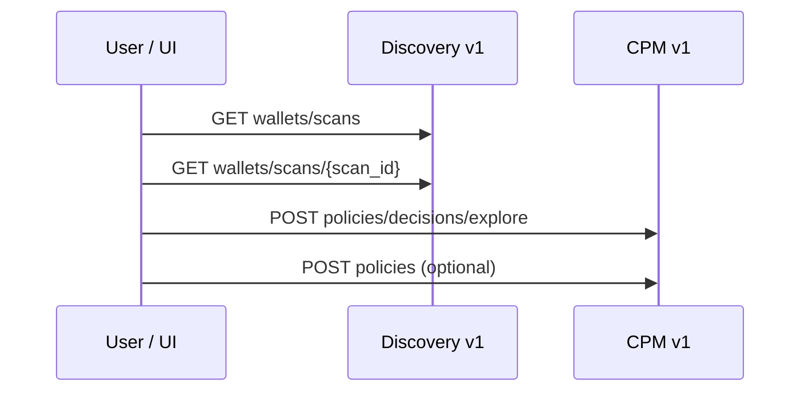

# CPM Option A — Discovery v1 scan to policy flow

**What is Option A?** Option A is the **post-V1 CPM integration path**: after the CPM frontend V1 policy workflow shipped, the product connects that page to **real user-owned wallet scans** via the **authenticated Discovery backend** (scan data is persisted behind Discovery today; Persistence Service remains the long-term owner). The UI selects a **`scan_id`**, loads v1 scan detail, and drives CPM explore/persist—**not** mock placeholders or direct DB access. A future **Option B** would expose scan context through an extracted Persistence Service API; Option A is the short-term path that respects current AuthN/AuthZ in Discovery. Full product intent, constraints, and data-flow rationale: [CPM `workplans/CPM_post_v_1_option_a_scan_context.md`](https://github.com/create2-labs/cafe-crypto-policy-mgt/blob/main/workplans/CPM_post_v_1_option_a_scan_context.md).

Public architecture summary for integrators and technical writers. Normative HTTP fields and **`policy_context`** mapping live in the Discovery maintainer contract and CPM workplans linked below.

## End-to-end path

1. **Wallet scan** is queued and stored (Discovery DB today; Persistence Service is the long-term scan-data owner).
2. **List + detail** — authenticated `GET /api/discovery/v1/wallets/scans` and `GET /api/discovery/v1/wallets/scans/{scan_id}`.
3. **CPM UI** — `cafe-frontend` F1–F5: scan selector, `policy_context` from detail, explore, validate, persist with real `scan_id`.
4. **Explore** — `POST /api/cpm/v1/policies/decisions/explore` with `scan_id`, **`policy_context`**, `selection_request`.
5. **Persist** — `POST /api/cpm/v1/policies` with `binding=discovery` and UUID `scan_id`.



## Explore vs async assessment

| Endpoint | Client `policy_context` | Purpose |
|----------|-------------------------|---------|
| `POST /api/cpm/v1/policies/decisions/explore` | **Required** (v1-aligned) | Synchronous ranked preview |
| `POST /api/cpm/v1/policies/assessment/request` | **Forbidden** | Async pipeline; CPM loads detail server-side |

Do not send `policy_context` to the assessment endpoint. See [CPM auth runbook](../security/cpm-auth-only-contract.md) troubleshooting for **400** / **404** on assessment.

## Removed route (historical)

`GET /discovery/wallet-policy-contexts` was removed in favor of v1 wallet scans ([Discovery PR11a](https://github.com/create2-labs/cafe-discovery/pull/54)). New docs and scripts must use **`/discovery/v1/wallets/scans`**.

## Canonical references

| Document | Location |
|----------|----------|
| Integrated narrative (CPM repo) | [cafe-crypto-policy-mgt `docs/CPM_OPTION_A_INTEGRATED.md`](https://github.com/create2-labs/cafe-crypto-policy-mgt/blob/main/docs/CPM_OPTION_A_INTEGRATED.md) |
| Field mapping §3.1 | [cafe-discovery `docs/CPM_OPTION_A_DISCOVERY_V1_CONTRACT.md`](https://github.com/create2-labs/cafe-discovery/blob/main/docs/CPM_OPTION_A_DISCOVERY_V1_CONTRACT.md) |
| API v1 developer guide | [03-cafe-developer-guide.md](../../03-cafe-developer-guide.md) |
| Merged PR index | [WORKPLAN_API_PR.md](https://github.com/create2-labs/cafe-crypto-policy-mgt/blob/main/workplans/WORKPLAN_API_PR.md) |
| Smoke script | [test-discovery-v1-wallet-scans-to-cpm.sh](https://github.com/create2-labs/cafe-crypto-policy-mgt/blob/main/scripts/test-discovery-v1-wallet-scans-to-cpm.sh) |

## Smoke test

```bash
export DISCOVERY_EMAIL='user@example.com' DISCOVERY_PASSWORD='secret'
SKIP_PERSIST=1 ./scripts/test-discovery-v1-wallet-scans-to-cpm.sh
```

Run from the `cafe-crypto-policy-mgt` repository root; see script `--help` for edge path overrides.
