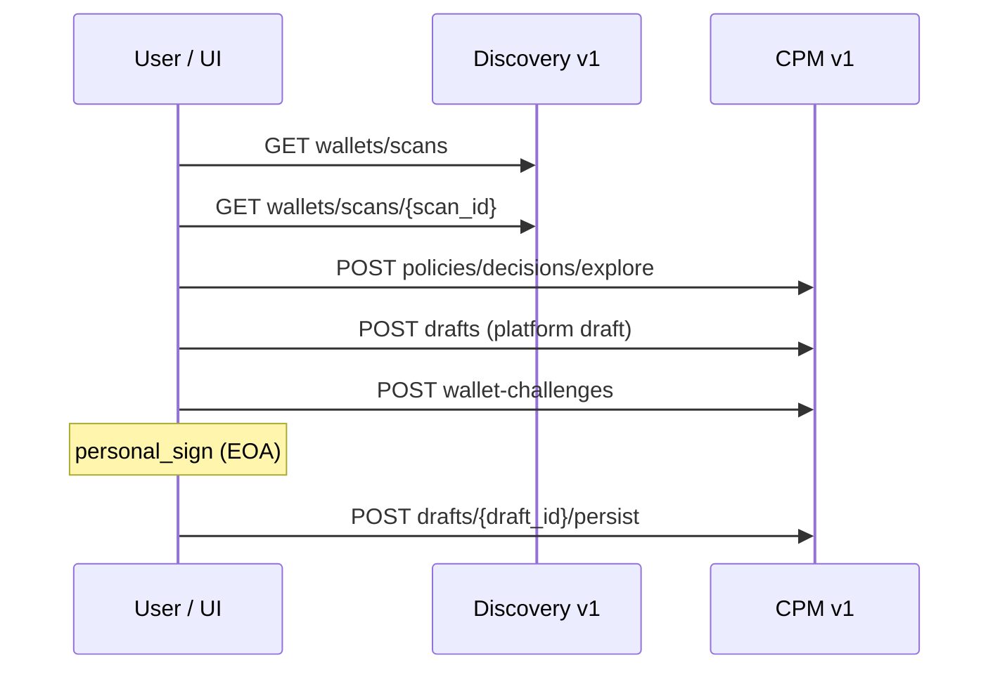

# CPM — Discovery v1 scan to policy flow

**What is Option A?** Option A is the **post-V1 CPM integration path**: after the CPM frontend V1 policy workflow shipped, the product connects that page to **real user-owned wallet scans** via the **authenticated Discovery backend** (scan data is persisted behind Discovery today; Persistence Service remains the long-term owner). The UI selects a **`scan_id`**, loads v1 scan detail, and drives CPM explore/persist—**not** mock placeholders or direct DB access. A future **Option B** would expose scan context through an extracted Persistence Service API; Option A is the short-term path that respects current AuthN/AuthZ in Discovery. Full product intent, constraints, and data-flow rationale: [CPM `workplans/CPM_post_v_1_option_a_scan_context.md`](https://github.com/create2-labs/cafe-crypto-policy-mgt/blob/main/workplans/CPM_post_v_1_option_a_scan_context.md).

Public architecture summary for integrators and technical writers. Normative HTTP fields and **`policy_context`** mapping live in the Discovery maintainer contract and CPM workplans linked below.

**CP-PERSIST V1 (EOA persist):** scan, explore, and platform draft save require **no** wallet proof. Normative EOA persist is `wallet-challenges` → EIP-191 sign → `POST /api/cpm/v1/drafts/{draft_id}/persist`. See [CP-PERSIST V1 runbook](../security/cp-persist-v1.md).

## End-to-end path

1. **Wallet scan** is queued and stored (Discovery DB today; Persistence Service is the long-term scan-data owner). **No wallet proof required.**
2. **List + detail** — authenticated `GET /api/discovery/v1/wallets/scans` and `GET /api/discovery/v1/wallets/scans/{scan_id}`.
3. **CPM UI** — `cafe-frontend` graph workspace (**CPM-UI-1…8**, user stories **US1–US21**): scan node, catalog on first edge, draft/persisted branches, implicit validation on **Persist** (**CPM-UI-8**), wallet-signed persist with real `scan_id`. Spec: [`CPM-specs-ui.md`](https://github.com/create2-labs/cafe-frontend/blob/main/CPM-specs-ui.md).
4. **Explore** — `POST /api/cpm/v1/policies/decisions/explore` with `scan_id`, **`policy_context`**, `selection_request`. **No wallet proof required.**
5. **Platform draft** — `POST /api/cpm/v1/drafts` (owner-scoped). **No wallet proof required.**
6. **Persist (EOA, CP-PERSIST V1)** — `POST /api/cpm/v1/wallet-challenges` → EIP-191 / `personal_sign` → `POST /api/cpm/v1/drafts/{draft_id}/persist` with `signed_message` + `signature`. **Wallet proof required.**



## Scan vs explore vs draft vs persist

| Phase | Wallet proof? | CPM route |
| --- | --- | --- |
| Scan (Discovery) | No | `POST /api/discovery/v1/scan`, `GET …/wallets/scans/{scan_id}` |
| Explore | No | `POST /api/cpm/v1/policies/decisions/explore` |
| Platform draft | No | `POST /api/cpm/v1/drafts` |
| Persist (EOA V1) | **Yes** | `POST …/wallet-challenges` then `POST …/drafts/{draft_id}/persist` |

Legacy `POST /api/cpm/v1/policies` is **not** the normative EOA persist path; EOA Discovery-bound payloads without signed authorization return **403** `WALLET_CONTROL_PROOF_REQUIRED`.

## Explore vs async assessment

| Endpoint | Client `policy_context` | Purpose |
|----------|-------------------------|---------|
| `POST /api/cpm/v1/policies/decisions/explore` | **Required** (v1-aligned) | Synchronous ranked preview; may return HTTP **200** with only `rejected_candidates` (no deployable CP) — see [observability runbook](../operations/cpm-explore-no-candidate-observability.md) |
| `POST /api/cpm/v1/policies/assessment/request` | **Forbidden** | Async pipeline; CPM loads detail server-side |

Do not send `policy_context` to the assessment endpoint. See [CPM auth runbook](../security/cpm-contract.md) troubleshooting for **400** / **404** on assessment.

## Canonical references

| Document | Location |
|----------|----------|
| CP-PERSIST V1 (stateless EOA persist) | [../security/cp-persist-v1.md](../security/cp-persist-v1.md) |
| Integrated narrative (CPM repo) | [cafe-crypto-policy-mgt `docs/CPM_OPTION_A_INTEGRATED.md`](https://github.com/create2-labs/cafe-crypto-policy-mgt/blob/main/docs/CPM_OPTION_A_INTEGRATED.md) |
| Field mapping §3.1 | [cafe-discovery `docs/CPM_OPTION_A_DISCOVERY_V1_CONTRACT.md`](https://github.com/create2-labs/cafe-discovery/blob/main/docs/CPM_OPTION_A_DISCOVERY_V1_CONTRACT.md) |
| API v1 developer guide | [03-cafe-developer-guide.md](../../03-cafe-developer-guide.md) |
| Merged PR index | [WORKPLAN_API_PR.md](https://github.com/create2-labs/cafe-crypto-policy-mgt/blob/main/workplans/WORKPLAN_API_PR.md) |
| Smoke scripts | [cafe-deploy README](https://github.com/create2-labs/cafe-deploy/blob/main/README.md#discoverycpm-smoke-scripts) |

## Smoke tests

```bash
# Explore only (S1–S3 non-regression — no wallet proof)
export DISCOVERY_EMAIL='user@example.com' DISCOVERY_PASSWORD='secret'
SKIP_PERSIST=1 ./scripts/test-discovery-v1-wallet-scans-to-cpm.sh

# Full CP-PERSIST V1: scan → explore → draft → sign → persist
SKIP_PERSIST=0 ./scripts/test-discovery-v1-wallet-scans-to-cpm.sh
```

Run from the `cafe-deploy` repository root; see script `--help` for edge path overrides. Layered CP-PERSIST smokes: `test-cpm-cp-persist-t3` … `t6` (see deploy README).
