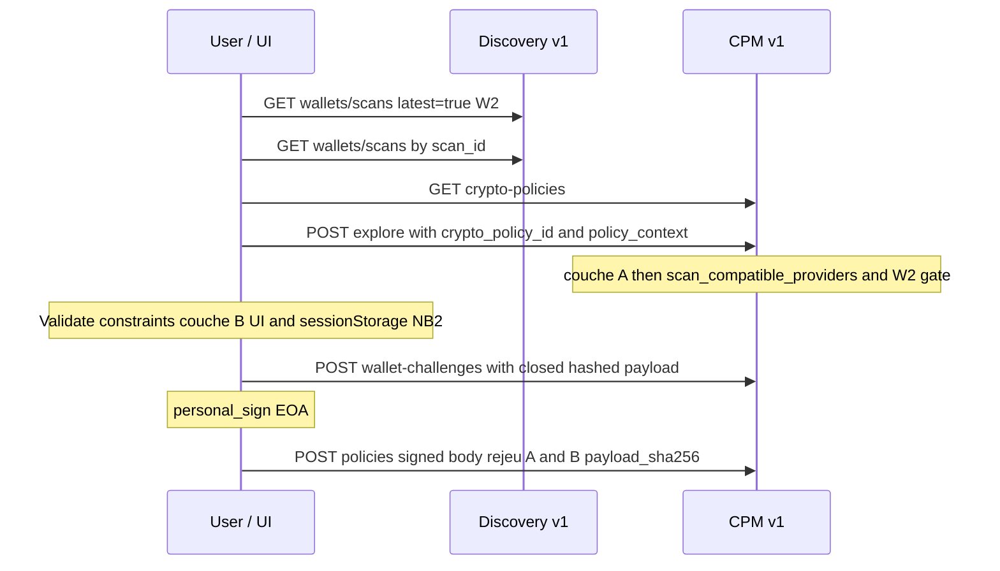

# CPM — Discovery v1 scan to policy flow

**What is Option A?** Option A is the **post-V1 CPM integration path**: after the CPM frontend V1 policy workflow shipped, the product connects that page to **real user-owned wallet scans** via the **authenticated Discovery backend** (scan data is persisted behind Discovery today; Persistence Service remains the long-term owner). The UI selects a **`scan_id`**, loads v1 scan detail, and drives CPM explore/persist—**not** mock placeholders or direct DB access. A future **Option B** would expose scan context through an extracted Persistence Service API; Option A is the short-term path that respects current AuthN/AuthZ in Discovery. Full product intent, constraints, and data-flow rationale: [CPM `workplans/CPM_post_v_1_option_a_scan_context.md`](https://github.com/create2-labs/cafe-crypto-policy-mgt/blob/main/workplans/CPM_post_v_1_option_a_scan_context.md).

Public architecture summary for integrators and technical writers. Normative HTTP fields and **`policy_context`** mapping live in the Discovery maintainer contract and CPM workplans linked below.

**ADR Capability Providers (amendement 2026-08):** two-layer model — **couche A** (explore → `scan_compatible_providers`) and **couche B** (persist `user_constraints`; UI filter indicative). Catalogue Crypto Policies expose `required_posture` + `allowed_providers` via `/crypto-policies`. No business policy graph; the UI derives its view from `solution_profile` fields. See [ADR_20260803_cp_provider_abstraction](https://github.com/create2-labs/cafe-adr/blob/main/ADR_20260803_cp_provider_abstraction.md) and [CPM README — Capability Providers](https://github.com/create2-labs/cafe-crypto-policy-mgt/blob/main/README.md).

**Remove CP drafts (ADR_20260824):** composition is **client-only** (NB2 `sessionStorage`). Normative EOA persist is `wallet-challenges` → EIP-191 sign → **`POST /api/cpm/v1/policies`** (signed body + `payload_sha256`). No `/drafts*`. Explore / challenge / persist are **W2**-gated. See [CP-PERSIST runbook](../security/cp-persist-v1.md) and [ADR_20260824_remove_cp_drafts](https://github.com/create2-labs/cafe-adr/blob/main/ADR_20260824_remove_cp_drafts.md).

## End-to-end path

1. **Wallet scan** is queued and stored (Discovery DB today; Persistence Service is the long-term scan-data owner). **No wallet proof required.**
2. **List + detail** — authenticated `GET /api/discovery/v1/wallets/scans` and `GET /api/discovery/v1/wallets/scans/{scan_id}`. Prefer **W2**: `?address=…&latest=true` (latest **completed** for owner+address).
3. **Catalogue Crypto Policy** — UI loads `GET /api/cpm/v1/crypto-policies` and the user selects a `crypto_policy_id` (no `default_selection`).
4. **CPM UI** — `cafe-frontend` solution profile view (**scénario A**): scan + CP selection, **scan-compatible** list, constraints panel seeded from `suggested_user_constraints`, validate constraints, soft findings. Spec: [`CPM-specs-ui.md`](https://github.com/create2-labs/cafe-frontend/blob/main/CPM-specs-ui.md) · maintainer: [`docs/cpm-developer.md`](https://github.com/create2-labs/cafe-frontend/blob/main/docs/cpm-developer.md).
5. **Explore (couche A)** — `POST /api/cpm/v1/policies/decisions/explore` with optional `scan_id`, **`crypto_policy_id`**, **`policy_context`**. Returns `scan_compatible_providers` with `required_posture`, `resulting_posture`, `solution_profile_ref`, `maturity`, `claim_status`, soft findings, and indicative `suggested_user_constraints`. **No** `selection_request` / couche B fields. **No wallet proof.** **W2 required** when scan-bound (`SCAN_NOT_LATEST` / `DISCOVERY_UNAVAILABLE`).
6. **Local composition (NB2)** — editor state in page memory / `sessionStorage` by `scan_id`. **No** `POST /drafts`. **No wallet proof.**
7. **Persist (EOA)** — `POST /api/cpm/v1/wallet-challenges` → EIP-191 / `personal_sign` → **`POST /api/cpm/v1/policies`** with `signed_message` + `signature` + `cafe.crypto_policy.v0.2` payload (`user_constraints` + `accepted_provider_snapshot` + top-level `accepted_findings`). CPM verifies hash + signature, **rejoue A+B**, writes W1 policy. **Wallet proof required.**


```mermaid
sequenceDiagram
  participant U as User / UI
  participant D as Discovery v1
  participant C as CPM v1
  U->>D: GET wallets/scans latest=true W2
  U->>D: GET wallets/scans by scan_id
  U->>C: GET crypto-policies
  U->>C: POST explore with crypto_policy_id and policy_context
  Note over C: couche A then scan_compatible_providers and W2 gate
  Note over U: Validate constraints couche B UI and sessionStorage NB2
  U->>C: POST wallet-challenges with closed hashed payload
  Note over U: personal_sign EOA
  U->>C: POST policies signed body rejeu A and B payload_sha256
```

## Scan vs explore vs compose vs persist

| Phase | Wallet proof? | Route / surface |
| --- | --- | --- |
| Scan (Discovery) | No | `POST /api/discovery/v1/scan`, `GET …/wallets/scans/{scan_id}` |
| Explore (couche A) | No | `POST /api/cpm/v1/policies/decisions/explore` (W2) |
| Local composition (NB2) | No | Client only — **not** `/drafts*` |
| Persist (EOA) | **Yes** | `POST …/wallet-challenges` then **`POST …/policies`** (W2) |

**Replace (NB1):** `DELETE /api/cpm/v1/policies?id=…` (JWT) then a new signed persist — not an atomic replace.

## Capability Provider — solution profile in the flow

The explore response public key is **`scan_compatible_providers`**. Each member includes:

```json
{
  "candidate_id": "cpx_pq_account_validation_nicetry_v1",
  "crypto_policy_id": "cpm_pq_account_validation_v1",
  "required_posture": "hybrid",
  "solution_profile_ref": {
    "provider_id": "nicetry",
    "solution_profile_id": "nicetry.fors_c.erc4337.v0_1",
    "manifest_version": "2026-08"
  },
  "resulting_posture": "hybrid",
  "maturity": "research",
  "claim_status": "declared",
  "compatibility_status": "compatible",
  "compatibility_findings": [],
  "suggested_user_constraints": {
    "allow_new_wallet": true,
    "address_continuity_required": false,
    "key_rotation_model": "per_userop"
  }
}
```

Key rules:
- **`required_posture`** comes from the catalogue Crypto Policy.
- **`resulting_posture`** comes from the provider's `SolutionProfile`.
- Hard compat (couche A): posture, wallet type, deployable chain + capabilities (including `rotate_signer` when profile is `per_userop`). Failure → `rejected_candidates`.
- **`claim_status: "declared"`** means the provider has *declared* this capability — it is **not** an audited or executed proof.
- Soft findings (`requires_bundler`, `requires_local_signer_state`) are non-blocking for couche A but must be accepted by the user before persist.
- **`suggested_user_constraints`** seeds the UI panel; user must **Validate my constraints** explicitly. Couche B is **not** applied on explore.
- **No policy graph** (`graphEdges`, `nodeInstances`, `node_path`) in explore response or UI.
- Retired live wire: `selection_request`, `target_posture` on explore (legacy → HTTP **400**).

## Explore vs async assessment

| Endpoint | Client body | Purpose |
|----------|-------------|---------|
| `POST /api/cpm/v1/policies/decisions/explore` | `crypto_policy_id` + `policy_context` (+ optional `scan_id`) | Synchronous couche A preview; may return HTTP **200** with empty `scan_compatible_providers` — see [observability runbook](../operations/cpm-explore-no-candidate-observability.md) |
| `POST /api/cpm/v1/policies/assessment/request` | `scan_id` + `crypto_policy_id` only | Async pipeline; CPM loads detail server-side; **no** `policy_context` |

Do not send `policy_context` or `selection_request` to the assessment endpoint. See [CPM auth runbook](../security/cpm-contract.md) troubleshooting for **400** / **404** on assessment (NATS legacy → validation error, not HTTP 400).

## Canonical references

| Document | Location |
|----------|----------|
| ADR Capability Providers | [cafe-adr — ADR_20260803_cp_provider_abstraction](https://github.com/create2-labs/cafe-adr/blob/main/ADR_20260803_cp_provider_abstraction.md) |
| ADR — remove CP drafts | [cafe-adr — ADR_20260824_remove_cp_drafts](https://github.com/create2-labs/cafe-adr/blob/main/ADR_20260824_remove_cp_drafts.md) |
| CPM README — Capability Providers | [cafe-crypto-policy-mgt README](https://github.com/create2-labs/cafe-crypto-policy-mgt/blob/main/README.md) |
| CP-PERSIST (signed `POST /policies`) | [../security/cp-persist-v1.md](../security/cp-persist-v1.md) |
| Normative CPM contract | [cafe-crypto-policy-mgt `docs/CP_PERSIST.md`](https://github.com/create2-labs/cafe-crypto-policy-mgt/blob/main/docs/CP_PERSIST.md) |
| OpenAPI | [openapi/cpm-v1.yaml](https://github.com/create2-labs/cafe-crypto-policy-mgt/blob/main/openapi/cpm-v1.yaml) |
| Integrated narrative (CPM repo) | [cafe-crypto-policy-mgt `docs/CPM_OPTION_A_INTEGRATED.md`](https://github.com/create2-labs/cafe-crypto-policy-mgt/blob/main/docs/CPM_OPTION_A_INTEGRATED.md) |
| Field mapping §3.1 | [cafe-discovery `docs/CPM_OPTION_A_DISCOVERY_V1_CONTRACT.md`](https://github.com/create2-labs/cafe-discovery/blob/main/docs/CPM_OPTION_A_DISCOVERY_V1_CONTRACT.md) |
| API v1 developer guide | [03-cafe-developer-guide.md](../../03-cafe-developer-guide.md) |
| FE maintainer (two-layer) | [cafe-frontend `docs/cpm-developer.md`](https://github.com/create2-labs/cafe-frontend/blob/main/docs/cpm-developer.md) |
| CPM UI specs | [cafe-frontend `CPM-specs-ui.md`](https://github.com/create2-labs/cafe-frontend/blob/main/CPM-specs-ui.md) |
| Merged PR index | [WORKPLAN_API_PR.md](https://github.com/create2-labs/cafe-crypto-policy-mgt/blob/main/workplans/WORKPLAN_API_PR.md) |
| Smoke scripts | [cafe-deploy README](https://github.com/create2-labs/cafe-deploy/blob/main/README.md#discoverycpm-smoke-scripts) |

## Smoke tests

```bash
# Explore only (no wallet proof)
export DISCOVERY_EMAIL='user@example.com' DISCOVERY_PASSWORD='secret'
SKIP_PERSIST=1 ./scripts/test-discovery-v1-wallet-scans-to-cpm.sh

# Full path: scan → explore → challenge → sign → POST /policies
SKIP_PERSIST=0 ./scripts/test-discovery-v1-wallet-scans-to-cpm.sh
```

Run from the `cafe-deploy` repository root; see script `--help` for edge path overrides. Backend gate: RD-P8 smokes (no SPA required).

> **Contract note:** `/drafts*` routes are removed. Persist uses signed `POST /api/cpm/v1/policies` with server-authoritative `payload_sha256`.
