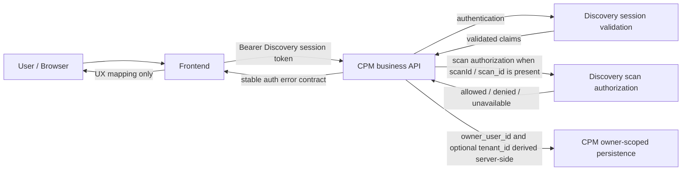

# CPM Auth-Only Contract and Runbook

## 1. Purpose

CPM is not an anonymous service. It consumes the same Discovery-issued session token used by the rest of the platform, validates it server-side, and derives an authenticated Principal. Scan-bound CPM operations must additionally be authorized against Discovery's scan visibility model. Drafts and persisted policies are scoped to the authenticated owner.

This contract records the authenticated-only behavior implemented across AUTH-01 through AUTH-07 and the API v1 assessment trigger rollout:

- No anonymous access is allowed to CPM business APIs.
- The frontend sends the existing Discovery-issued session token to CPM.
- CPM authenticates the caller and derives server-side identity.
- Discovery remains the authority for scan visibility.
- Drafts and policies are owner-scoped.
- Authentication and authorization decisions are server-side.
- The frontend maps backend outcomes to user-facing UX states; it does not implement CPM authorization rules.

## 2. Architecture Overview



The important service boundaries are:

- Authentication: CPM validates Discovery-issued session tokens before serving business routes.
- Scan authorization: Discovery answers whether the authenticated Principal can read or use a scan.
- Owner-scoped persistence: CPM stores and reads drafts and policies under the authenticated owner.
- Frontend UX mapping: the frontend renders states from CPM responses but does not decide access.

## 3. Authentication Model

Discovery issues the platform session token. The frontend reuses that Bearer token when calling CPM. CPM does not issue a CPM-specific JWT and does not define a CPM-specific JWT secret, issuer, or audience.

Current Discovery session tokens are PQC hybrid JWS JSON envelopes encoded as base64url with EdDSA and ML-DSA-65 signatures. Current Discovery session-token semantics do not rely on issuer or audience checks.

Identity is derived from Discovery-validated claims, primarily `user_id` and optionally `email`. CPM may fast-fail malformed or expired tokens locally, but it only injects a Principal after Discovery validation succeeds.

Relevant CPM environment variables:

- `CPM_AUTH_REQUIRED`
- `CAFE_SESSION_JWT_VALIDATION_URL`
- `CAFE_SESSION_JWT_VALIDATION_TIMEOUT_SEC`
- `CAFE_SESSION_JWT_VALIDATION_SERVICE_TOKEN`

`CAFE_SESSION_JWT_VALIDATION_SERVICE_TOKEN` is service-to-service authorization for CPM-to-Discovery session validation when enabled. It is not a user token. Static service tokens are temporary dev/staging placeholders and should be replaced by mTLS or signed service JWTs for production hardening.

## 4. Protected Routes

Every CPM route must be explicitly classified. No unclassified CPM business route is allowed, and anonymous access to business routes must return `401`.

| Route | Method | Classification | Expected access |
| --- | --- | --- | --- |
| `/healthz` | `GET` | Public health/readiness | Anonymous allowed |
| `/api/cpm/v1/policies/catalog` | `GET` | Authenticated business endpoint | Discovery session required |
| `/api/cpm/v1/policies/templates` | `GET` | Authenticated business endpoint | Discovery session required |
| `/api/cpm/v1/policies/instances` | `GET` | Authenticated business endpoint | Discovery session required |
| `/api/cpm/v1/policies/decisions/explore` | `POST` | Authenticated business endpoint | Discovery session required; scan authorization when scan-bound |
| `/api/cpm/v1/drafts` | `POST` | Authenticated business endpoint | Discovery session required; owner-scoped |
| `/api/cpm/v1/drafts?id=...` | `GET` | Authenticated business endpoint | Discovery session required; owner-scoped |
| `/api/cpm/v1/policies` | `POST` | Authenticated business endpoint | Discovery session required; owner-scoped |
| `/api/cpm/v1/policies?id=...` | `GET` | Authenticated business endpoint | Discovery session required; owner-scoped |
| `/api/cpm/v1/policies/assessment/request` | `POST` | Authenticated business endpoint | Discovery session required; wallet-scan only; no client `policy_context` |
| `/internal/policies/references/scan` | `POST` | Internal service endpoint | Service Bearer token required when `CPM_AUTH_REQUIRED=true` |
| Deprecated or disabled routes | Any | Deprecated/disabled | Must remain disabled or be explicitly reclassified before use |

Future routes must be classified as public health/readiness, authenticated business endpoint, or deprecated/disabled before they are enabled.

## 5. Scan Authorization Model

CPM delegates scan visibility decisions to Discovery. CPM must not read Discovery persistence directly.

Any CPM request carrying `scanId` or `scan_id` triggers scan authorization. CPM extracts scan IDs from the top-level payload and from draft payloads. If multiple scan IDs are present, they must be identical. Conflicting scan IDs return `400`; malformed or empty scan IDs return `400`.

For a valid scan-bound request, CPM calls Discovery to ask whether the authenticated Principal can read or use the scan. CPM fails closed if Discovery scan authorization is unavailable.

Discovery endpoint:

```http
POST /internal/authz/scans/:scanId/can-read
```

Headers:

- `X-User-Id`
- `X-Tenant-Id` optional
- `X-Request-Id`
- Internal service `Authorization` token if configured

Discovery response examples:

Allowed:

```http
HTTP 200
```

```json
{ "allowed": true, "reason_code": "SCAN_AUTHZ_ALLOWED", "request_id": "req_..." }
```

Forbidden:

```http
HTTP 403
```

```json
{ "allowed": false, "reason_code": "SCAN_AUTHZ_FORBIDDEN", "request_id": "req_..." }
```

Not visible:

```http
HTTP 403
```

```json
{ "allowed": false, "reason_code": "SCAN_AUTHZ_NOT_VISIBLE", "request_id": "req_..." }
```

Malformed:

```http
HTTP 400
```

```json
{ "allowed": false, "reason_code": "SCAN_AUTHZ_SCAN_ID_MALFORMED", "request_id": "req_..." }
```

Unavailable:

```http
HTTP 503
```

```json
{ "allowed": false, "reason_code": "SCAN_AUTHZ_UNAVAILABLE", "request_id": "req_..." }
```

For general scan-bound CPM routes, not-visible and unknown scans return `403`. Anti-enumeration `404` concealment is deferred except where a route-specific contract says otherwise.

`POST /api/cpm/v1/policies/assessment/request` has a stricter product contract: unknown scans, scans not readable by the owner, TLS scans, and non-wallet scans return `404`. It must not return `403` for scan visibility on this route.

Default TLS entries are admin-provisioned public/system entries. They are not user-created scan results and may be readable by any authenticated principal. User-created TLS scans remain owner-scoped and must not be globally readable. Implementations must not treat all TLS scans as public by type.

`X-Tenant-Id` is propagated for traceability. Tenant enforcement is deferred until scan records carry `tenant_id`; do not claim full tenant enforcement until the data model supports it.

## 6. Owner-Scoped Persistence Model

Drafts and policies are scoped to the authenticated Principal. `owner_user_id` and optional `tenant_id` are derived server-side. Client payloads cannot set or override owner fields.

Owner-scoped routes:

- `POST /api/cpm/v1/drafts`
- `GET /api/cpm/v1/drafts?id=...`
- `POST /api/cpm/v1/policies`
- `GET /api/cpm/v1/policies?id=...`

Cross-user read or update returns `403`. Missing Principal returns `401`. Anonymous legacy records are inaccessible under the owner-scoped model. No backfill is included in the current rollout unless separately implemented; local and dev data may need to be regenerated.

## 7. Error Contract

CPM auth errors return a stable JSON payload:

```json
{
  "code": "AUTHZ_SCAN_FORBIDDEN",
  "message": "scan access denied",
  "details": {},
  "request_id": "req_..."
}
```

Required fields:

- `code`
- `message`
- `details`
- `request_id`

`details` is always an object. `request_id` is propagated from `X-Request-Id` when safe, otherwise generated. Request IDs are sanitized.

HTTP mappings:

| Category | Code | HTTP status |
| --- | --- | --- |
| Authentication | `AUTH_UNAUTHENTICATED` | `401` |
| Authentication | `AUTH_VALIDATION_UNAVAILABLE` | `503` |
| Scan authorization | `AUTHZ_SCAN_ID_MALFORMED` | `400` |
| Scan authorization | `AUTHZ_SCAN_ID_CONFLICT` | `400` |
| Scan authorization | `AUTHZ_SCAN_FORBIDDEN` | `403` |
| Scan authorization | `AUTHZ_SCAN_UNAVAILABLE` | `503` |
| Owner-scoped persistence | `AUTHZ_OWNER_FORBIDDEN` | `403` |
| Owner-scoped persistence | `AUTHZ_PRINCIPAL_REQUIRED` | `401` |
| Assessment request | malformed request or client `policy_context` | `400` |
| Assessment request | unknown, unauthorized, TLS, or non-wallet `scan_id` | `404` |
| Assessment request | Discovery authz or detail unavailable | `503` |

Raw tokens, secrets, emails, full claims, request bodies, and scan metadata must not be returned in auth error responses.

## 8. Frontend UX Contract

The frontend reuses the Discovery session token for CPM calls. It does not implement authorization rules. CPM data-source boundaries map backend errors to typed frontend states.

| Backend outcome | Frontend state |
| --- | --- |
| `401`, `AUTH_UNAUTHENTICATED`, or `AUTHZ_PRINCIPAL_REQUIRED` | Session expired / sign in again |
| `403`, `AUTHZ_SCAN_FORBIDDEN`, or `AUTHZ_OWNER_FORBIDDEN` | Access denied to scan or policy |
| `400` malformed or conflicting scan ID | Invalid selected scan reference |
| `503`, validation unavailable, or scan authorization unavailable | Retryable authorization unavailable |
| Legacy/plain `503` | Unavailable |
| Unknown outcome | Generic CPM request failure |

`403` must not trigger logout. `503` must not trigger logout. CPM `401` clears session but avoids immediate hard redirect so the CPM page can show its banner and sign-in action. `request_id` may be displayed as diagnostic metadata.

## 9. Deploy and E2E Contract

The dev stack must wire CPM auth, session validation, and scan authorization environment variables. Discovery's internal scan authorization service token must match CPM's scan authorization service token. **`CAFE_POLICY_REFERENCE_INTERNAL_SERVICE_TOKEN`** on CPM must be set whenever **`CPM_AUTH_REQUIRED=true`** so **`POST /internal/policies/references/scan`** is gated (WORKPLAN PR5); the same secret must be configured on Discovery for outbound calls when **PR6** lands. Staging and production templates must not bake secrets. CPM auth is enabled by default.

Required dev e2e cases:

- CPM `/healthz` is public.
- Anonymous `/api/cpm/v1` business route returns `401`.
- Invalid token returns `401`.
- Valid Discovery token succeeds.
- Valid token with forbidden scan returns `403`.
- Valid token with allowed scan succeeds.
- Owner-scoped draft/policy anonymous access returns `401`.
- Owner-scoped cross-user access returns `403`.
- CPM internal policy reference: valid service token + body → `200` with `referenced` boolean; wrong token → `403`; missing server token config → `503`.
- CPM assessment request: wallet scan → `202`; body with `policy_context` → `400`; unknown, unauthorized, TLS, or non-wallet scan → `404`; Discovery outage → `503`.
- `request_id` is propagated.

Command example:

```sh
./scripts/e2e-dev-stack.sh --suite auth06
```

## 10. Environment Variable Reference

| Variable | Service | Required | Default | Environment | Description |
| --- | --- | --- | --- | --- | --- |
| `CPM_AUTH_REQUIRED` | CPM | Yes | `true` | Dev, staging, prod | Enables authenticated-only CPM business routes. |
| `CAFE_SESSION_JWT_VALIDATION_URL` | CPM | Yes when auth is required | None | Dev, staging, prod | Discovery session validation endpoint used by CPM. |
| `CAFE_SESSION_JWT_VALIDATION_TIMEOUT_SEC` | CPM | No | Implementation default | Dev, staging, prod | Timeout for Discovery session validation calls. |
| `CAFE_SESSION_JWT_VALIDATION_SERVICE_TOKEN` | CPM | Required if Discovery validation service auth is enabled | None | Dev, staging, prod | Service-to-service token for CPM-to-Discovery session validation; not a user token. |
| `CAFE_SCAN_AUTHORIZATION_URL` | CPM | Yes for scan-bound CPM routes | None | Dev, staging, prod | Discovery scan authorization endpoint. |
| `CAFE_SCAN_AUTHORIZATION_TIMEOUT_SEC` | CPM | No | Implementation default | Dev, staging, prod | Timeout for Discovery scan authorization calls. |
| `CAFE_SCAN_AUTHORIZATION_SERVICE_TOKEN` | CPM | Required if Discovery internal authz service auth is enabled | None | Dev, staging, prod | Service-to-service token for CPM-to-Discovery scan authorization. |
| `CAFE_DISCOVERY_HTTP_BASE` | CPM | Yes for assessment request | None | Dev, staging, prod | Direct Discovery backend base used by CPM to fetch authoritative wallet scan detail. |
| `CPM_NATS_URL` | CPM | Yes for async assessment publication | None | Dev, staging, prod | NATS connection used to publish `policy.assessment.requested.v0.1`. |
| `CAFE_POLICY_REFERENCE_INTERNAL_SERVICE_TOKEN` | CPM | **Yes** when `CPM_AUTH_REQUIRED=true` (internal route otherwise returns **503** misconfiguration) | None in compose; dev template sets a placeholder | Dev, staging, prod | Bearer secret for **`POST /internal/policies/references/scan`** (policy instances referencing a `scan_id`). Must equal Discovery’s outbound service token once **PR6** wires the HTTP client. If `CPM_AUTH_REQUIRED=false`, CPM disables **all** auth middleware (including this route) — not for exposed staging/prod. |
| `DISCOVERY_INTERNAL_AUTHZ_ENABLED` | Discovery | Yes | `true` in authenticated dev stack | Dev, staging, prod | Enables Discovery internal scan authorization lookup for CPM. |
| `DISCOVERY_INTERNAL_AUTHZ_SERVICE_TOKEN` | Discovery | Required when internal authz service auth is enabled | None | Dev, staging, prod | Discovery-side expected service token for internal scan authorization. |

Static service tokens are temporary dev/staging placeholders. Production should move to mTLS or signed service JWTs. Secrets must not be committed.

## 11. Observability

CPM and Discovery should emit structured logs, request IDs, safe reason codes, and metrics counters for auth decisions.

CPM metric:

- `cpm_auth_decisions_total`
- Labels: `category`, `outcome`, `code`, `route`

Discovery metric:

- `discovery_scan_authz_decisions_total`
- Labels: `outcome`, `reason_code`, `route`

Forbidden metric labels:

- `user_id`
- `scanId`
- `request_id`
- token values
- raw paths with IDs
- email

Logs may include `request_id`, route, method, category, outcome, reason code, and authenticated `user_id` when safe. Logs must not include raw `Authorization` headers, session tokens, service tokens, full claims, email, request body, or scan metadata.

## 12. Troubleshooting Runbook

| Symptom | Likely causes | Checks |
| --- | --- | --- |
| CPM business route returns `401` | Missing Bearer token; expired Discovery session; invalid Discovery session; Discovery session validation endpoint rejects token; frontend did not attach token. | Verify frontend `Authorization` header; verify Discovery login/session; inspect CPM logs by `request_id`; check `CAFE_SESSION_JWT_VALIDATION_URL`. |
| CPM business route returns `503 AUTH_VALIDATION_UNAVAILABLE` | Discovery validation endpoint down; wrong service URL; timeout; service token mismatch. | Check container-to-container DNS; inspect env vars; check Discovery health; inspect CPM logs. |
| Scan-bound CPM route returns `403 AUTHZ_SCAN_FORBIDDEN` | User does not own or cannot see scan; wrong `scanId`; Discovery says not visible. | Verify scan owner in Discovery; verify user ID propagation; check Discovery scan authz logs with `request_id`. |
| Scan-bound CPM route returns `503 AUTHZ_SCAN_UNAVAILABLE` | Discovery scan authz endpoint down; wrong `CAFE_SCAN_AUTHORIZATION_URL`; service token mismatch; Discovery internal authz disabled. | Check CPM env; check Discovery env; verify service auth token match; check internal endpoint availability. |
| CPM assessment request returns `400` | Malformed body, invalid `selection_request`, disallowed unknown field, or client supplied `policy_context`. | Remove `policy_context`; validate `scan_id` shape and selection payload against `cpm-v1.yaml`. |
| CPM assessment request returns `404` | `scan_id` is unknown, not readable by the owner, or references TLS/non-wallet scan detail. | Verify the scan exists through `GET /api/discovery/v1/wallets/scans/{scan_id}` with the same user token; do not use TLS scan IDs for CPM assessment. |
| CPM assessment request returns `503` | Discovery authz/detail lookup unavailable or CPM cannot publish the async command. | Check `CAFE_SCAN_AUTHORIZATION_URL`, `CAFE_DISCOVERY_HTTP_BASE`, `CPM_NATS_URL`, service tokens, and CPM logs keyed by `request_id`. |
| CPM **`POST /internal/policies/references/scan`** returns **`503 AUTH_INTERNAL_MISCONFIGURED`** | `CAFE_POLICY_REFERENCE_INTERNAL_SERVICE_TOKEN` unset while `CPM_AUTH_REQUIRED=true`. | Set a non-empty token on **cafe-cpm**; align Discovery (PR6) to send the same Bearer; see `cafe-deploy` `env/*.env.template`. |
| CPM internal reference returns **`403`** from CPM | Wrong `Authorization: Bearer` for the internal call. | Rotate/sync `CAFE_POLICY_REFERENCE_INTERNAL_SERVICE_TOKEN` with Discovery’s outbound secret. |
| Draft/policy returns `403 AUTHZ_OWNER_FORBIDDEN` | User is trying to read or update another user's draft/policy; owner fields were migrated incorrectly; stale local/dev data. | Verify `owner_user_id`; verify `tenant_id` if present; regenerate dev data if the record is anonymous legacy data. |
| Frontend redirects unexpectedly instead of showing CPM banner | Request missing CPM auth UX marker; interceptor regression; request not going through CPM data-source boundary. | Inspect frontend request config; run AUTH-07 tests. |
| E2E AUTH-06 fails forbidden/allowed scan cases | Test scan fixture not owned by expected user; Discovery AUTH-05 not deployed in image; service token mismatch; default TLS public fixture confused with user-created scan. | Verify fixture setup; verify scan owner; verify Discovery endpoint path; verify service token. |
| `curl`/`bash` callers see TLS verify failures or opaque failures against **`https://`** gateways | Untrusted issuer (self-signed, private CA); hostname mismatch; wrong port/path. | Use a CA trusted by the client machine, or **`curl -k`** only in dev (`CURL_INSECURE=1` in [`wallet-scan-and-cpm-policy.sh`](https://github.com/create2-labs/cafe-crypto-policy-mgt/blob/main/scripts/wallet-scan-and-cpm-policy.sh)); confirm URL matches Ingress / load-balancer **`https`** frontend. |
| HTTP **`500`** from Discovery or CPM behind TLS | Backend panic, dependency unavailable, or upstream timeout surfaced as generic 500—body may still carry JSON **`error`** / **`code`**. | Read response body + service logs keyed by **`X-Request-Id`** / `request_id`; verify session-validation and scan-authz URLs reachable from CPM (**`443`** vs **`80`** mix-ups are common behind split listeners). |

## 13. Security Notes and Limitations

- Anti-enumeration `404` concealment is deferred.
- Static service tokens are temporary.
- Tenant enforcement is deferred until scan records carry `tenant_id`.
- Default TLS public/system entries are intentionally globally readable by authenticated users.
- User-created scans remain owner-scoped.
- Frontend UX does not imply authorization.
- All server-side auth decisions must remain on CPM and Discovery.

## 14. Review Checklist

- No anonymous CPM business route.
- No unclassified CPM route.
- No CPM-specific JWT model.
- No owner fields accepted from the client.
- No scan-bound request without Discovery-backed authorization.
- No direct CPM access to Discovery DB.
- No tokens or secrets in logs.
- No `user_id`, `scanId`, or `request_id` metric labels.
- E2E no-token, invalid-token, forbidden, and allowed paths pass.
