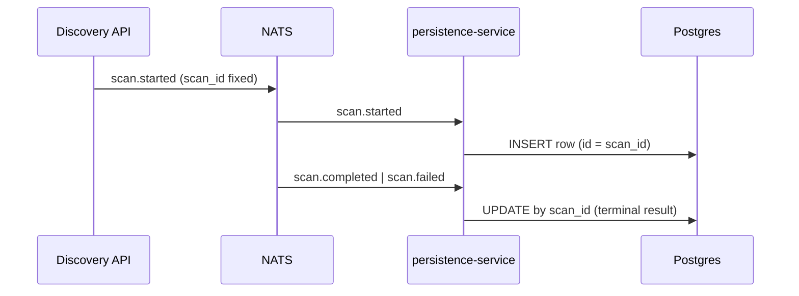

# CAFE — Technical Specifications

1. [CAFE — Technical Specifications](#cafe--technical-specifications)
2. [Introduction](#introduction)
   1. [Technical scope](#technical-scope)
   2. [Repositories](#repositories)
3. [Architecture](#architecture)
4. [Public HTTP API](#public-http-api)
5. [Discovery service](#discovery-service)
6. [CPM service](#cpm-service)
7. [Frontend](#frontend)
8. [Infrastructure and deployment](#infrastructure-and-deployment)
9. [Data storage](#data-storage)
10. [Messaging and scan pipeline](#messaging-and-scan-pipeline)
11. [Testing and quality assurance](#testing-and-quality-assurance)
12. [External tools](#external-tools)
13. [Glossary](#glossary)
14. [References](#references)

---

## Introduction

This document describes **how CAFE is built and operated**: services, APIs, persistence, deployment, and verification. Product behavior and governance rules are in [functional-specifications.md](./functional-specifications.md).

### Technical scope

| Area | Technology / pattern |
| --- | --- |
| Discovery API | Go (Fiber), OpenAPI v1, PostgreSQL, Redis cache, NATS events |
| CPM API | Go, owner-scoped persistence, JWT from Discovery |
| Scanners | Separate worker images (wallet EVM, TLS) |
| Frontend | Web SPA (React), Bearer session to Discovery/CPM |
| Edge | NGINX (or equivalent) — `/api/discovery/v1`, `/api/cpm/v1` |
| Contracts | Shared wire types in `cafe-contracts` |

Non-goals for this document: line-by-line OpenAPI field lists (see per-repo `openapi/` and developer guide).

### Repositories

| Repository | Role |
| --- | --- |
| `cafe-discovery` | Discovery API, persistence service, scanners, OpenAPI |
| `cafe-crypto-policy-mgt` | CPM API, policy domain, immutability guards |
| `cafe-frontend` | User interface |
| `cafe-deploy` | Compose, Ansible, smoke scripts, runbooks |
| `cafe-documentation` | Product and integration docs (this directory) |
| `cafe-crypto-backend` | PQC cryptographic tooling |
| `cafe-scanner-wallet`, `cafe-scanner-tls` | Scanner implementations |
| `cafe-edge` | PQC-capable reverse proxy images |
| `cafe-contracts` | Shared observation and event schemas |

---

## Architecture

### Logical view

```text
                    ┌─────────────────────────────────────┐
                    │           Edge (TLS, routing)        │
                    │  /api/discovery/v1/*  /api/cpm/v1/* │
                    └───────────┬─────────────┬───────────┘
                                │             │
              ┌─────────────────▼──┐    ┌─────▼──────────────┐
              │   cafe-discovery   │    │ cafe-crypto-policy │
              │   cmd/server       │    │      -mgt          │
              └─────────┬──────────┘    └─────────┬──────────┘
                        │                         │
         ┌──────────────┼──────────────┐          │
         ▼              ▼              ▼          ▼
    ┌─────────┐   ┌──────────┐  ┌────────┐  ┌────────┐
    │  NATS   │   │ Postgres │  │ Redis  │  │  NATS  │
    └────┬────┘   └──────────┘  └────────┘  └────────┘
         │
    ┌────▼────────────────────────────┐
    │ cmd/scanner (wallet)            │
    │ cmd/scanner / TLS worker        │
    │ cmd/persistence (event writers) │
    └─────────────────────────────────┘
```

### Authentication flow

1. Client obtains Bearer token from Discovery `POST /auth/signin`.
2. Discovery and CPM validate the same JWT (opaque to clients).
3. CPM does not issue a separate user token.

### CPM ↔ Discovery coupling

- **Synchronous:** CPM HTTP handlers call Discovery v1 wallet scan list/detail (service token or user token per route class).
- **Guards:** `internal/app/auth.go` — W7 (`limit=1` newest row), W2 (`latest=true`), TLS rejection.
- **Async:** `POST …/policies/assessment/request` loads wallet detail server-side; rejects TLS.

See [docs/architecture/cpm-option-a-v1-flow.md](./docs/architecture/cpm-option-a-v1-flow.md).

---

## Public HTTP API

Canonical path prefixes (edge):

| Service | Base path |
| --- | --- |
| Discovery | `/api/discovery/v1` |
| CPM | `/api/cpm/v1` |

**Route registration order (Discovery):** register `…/wallets/scans` and `…/wallets/scans/{scan_id}` **before** `…/wallets/{wallet_id}` so `scans` is not captured as a wallet id.

Non-canonical public URLs must return **404** at the edge; regression checks live in `cafe-deploy/scripts/lib/discovery-v1-http-smoke.sh`.

Full route tables: [03-cafe-developer-guide.md](./03-cafe-developer-guide.md) and [`WORKPLAN_API.md` §0](https://github.com/create2-labs/cafe-crypto-policy-mgt/blob/main/workplans/WORKPLAN_API.md).

---

## Discovery service

### Components

| Binary / package | Responsibility |
| --- | --- |
| `cmd/server` | HTTP API, auth, scan enqueue, v1 handlers |
| `cmd/persistence` | NATS consumers → Postgres writers |
| `cmd/scanner` | Wallet scan execution |
| TLS scanner image | Endpoint TLS analysis |
| `internal/handler/discovery_v1_*.go` | v1 list/detail/delete/CBOM |
| `internal/persistence/storage/postgres.go` | Row-per-execution writers |
| `openapi/discovery-v1.yaml` | Machine-readable contract |

### Scan persistence model (target)

- **One Postgres row per execution**; primary key `id` = `scan_id`.
- **Re-scan** = `INSERT` new row; prior row unchanged.
- **Terminal** `result` not updated in place.
- **Indexes:** non-unique `(user_id, address, created_at)` for listing; same pattern for TLS URL.

Gap analysis and migration: [`cafe-discovery/docs/SCAN_IMMUTABILITY_MIGRATION.md`](https://github.com/create2-labs/cafe-discovery/blob/main/docs/SCAN_IMMUTABILITY_MIGRATION.md).

### Redis

- Accelerator / cache only after immutability rollout; **Postgres is source of truth** for v1 list/detail.
- Delete wallet scan: evict Redis address key only when **no** remaining Postgres rows for that address.

### Error codes (representative)

| Code | HTTP | When |
| --- | --- | --- |
| `SCAN_IN_PROGRESS` | 409 | W8 — newest `requested` or `started` |
| `CPM_EXISTS_FOR_WALLET_TARGET` | 409 | W1 — policy or draft on address |
| `SCAN_REFERENCED_BY_POLICY` | 409 | W3 — DELETE scan with CPM reference |
| `chain_id` without `address` | 400 | Invalid list query |

### OpenAPI and contracts

- Discovery v1: `cafe-discovery/openapi/discovery-v1.yaml`
- CPM export projection: `cafe-discovery/docs/CPM_OPTION_A_DISCOVERY_V1_CONTRACT.md`

---

## CPM service

### Layout

| Path | Purpose |
| --- | --- |
| `cmd/cafe-cpm` | Entrypoint |
| `internal/app/auth.go` | Scan immutability guards, Discovery client |
| `internal/app/authz_scan_test.go` | W2, W7, TLS rejection tests |
| `internal/api/` | HTTP handlers (read, explore, persist) |
| `internal/domain/policy/` | Policy models and evaluation |
| `internal/persistence/` | Owner-scoped store |

### Guard implementation notes

| Guard | Implementation hint |
| --- | --- |
| **W7** | `GET …/wallets/scans?limit=1` + default sort — **not** `latest=true` |
| **W2** | `GET …/wallets/scans?address=&latest=true` — **not** `limit=1` alone |
| **TLS** | Reject `scan_family: tls` in detail JSON → `404 not_found` on explore/persist |

### Assessment pipeline

- Inbound: explicit user trigger via assessment request endpoint.
- `cafe.discovery.wallet.observed` v0.1 remains informational; not a silent DB coupling.

Integrated narrative: [`cafe-crypto-policy-mgt/docs/CPM_OPTION_A_INTEGRATED.md`](https://github.com/create2-labs/cafe-crypto-policy-mgt/blob/main/docs/CPM_OPTION_A_INTEGRATED.md).

---

## Frontend

- Repository: `cafe-frontend`
- Consumes `/api/discovery/v1` and `/api/cpm/v1` through edge.
- **Option A flow:** scan selector → detail → `policy_context` → explore → persist.
- UX rules for W1 draft export/reload: [`IMMUTABILITE.md`](https://github.com/create2-labs/cafe-frontend/blob/main/IMMUTABILITE.md) (English + French section; product rules in English).

---

## Infrastructure and deployment

- **`cafe-deploy`:** Docker Compose stacks, Ansible, nginx templates, smoke scripts.
- **Immutability smoke suite** (orchestrated by `scripts/tests-scans.sh`):

| Script | Covers |
| --- | --- |
| `test-discovery-imm9-wallet-scan-w1-cpm-block.sh` | W1 |
| `test-cpm-imm10-wallet-scan-w7-w2-guards.sh` | W7, W2 |
| `test-discovery-w3-w4-scan-policy-delete.sh` | W3, W4 |
| `test-discovery-imm12-wallet-scan-cbom.sh` | W6 / CBOM |
| `lib/discovery-v1-http-smoke.sh` | Legacy 404 |

- **Atomic deploy:** IMM-2 (schema/index) + IMM-3 (writers) in same window — see `cafe-deploy/docs/RUNBOOK_SCAN_HISTORY.md`.

Security hardening: `cafe-deploy/SECURITY_ENHANCEMENT.md`, `cafe-documentation/docs/security/cpm-auth-only-contract.md`.

---

## Data storage

### PostgreSQL (Discovery)

| Table (conceptual) | Key | Notes |
| --- | --- | --- |
| `scan_results` | `id` = `scan_id` | Wallet executions per user |
| `tls_scan_results` | `id` = `scan_id` | TLS executions per user |

Soft-delete and owner scoping apply per implementation.

### CPM persistence

- Owner-scoped in-memory or configured store for drafts and policy instances (deployment-dependent).
- Policies reference `scan_id` UUID; no foreign key into Discovery DB.

---

## Messaging and scan pipeline



Events must not upsert by `(user_id, address)` in a way that replaces `scan_id`.

---

## Testing and quality assurance

### Layers

| Layer | Location | Purpose |
| --- | --- | --- |
| Unit / contract | `cafe-discovery/internal/contract/`, `internal/handler/*_test.go` | API envelopes, guards, immutability |
| CPM authz | `cafe-crypto-policy-mgt/internal/app/authz_scan_test.go` | W2, W7, TLS |
| Smoke | `cafe-deploy/scripts/test-*.sh` | Cross-service E2E |
| QA checklist | [docs/api/api-v1-qa-checklist.md](./docs/api/api-v1-qa-checklist.md) | Release sign-off |

### Product acceptance traceability

End-to-end criteria and test mapping: [`cafe-discovery/IMMUTABILITE_PR.md` § product acceptance](https://github.com/create2-labs/cafe-discovery/blob/main/IMMUTABILITE_PR.md) (maintainer table; French labels).

Run all scan immutability smokes:

```bash
cd cafe-deploy/scripts
./tests-scans.sh
```

---

## External tools

| Tool | Use in CAFE |
| --- | --- |
| CycloneDX | CBOM format reference |
| NIST PQC standards | Algorithm classification |
| Ethereum / EVM RPC | Wallet scans |
| TLS 1.3 + hybrid KEM test endpoints | TLS scans |
| Turnstile (optional) | Sign-up bot protection |

---

## Glossary

| Term | Definition |
| --- | --- |
| **Edge** | Reverse proxy exposing unified `/api/*` paths |
| **IMM** | Scan immutability implementation milestone (IMM-1 … IMM-12) |
| **NATS** | Message bus for scan lifecycle events |
| **Option A** | CPM integration via Discovery v1 `scan_id` |
| **persistence-service** | Discovery component writing scan rows from NATS |
| **Postgres-first** | v1 reads authoritative from PostgreSQL |

---

## References

| Document | Role |
| --- | --- |
| [functional-specifications.md](./functional-specifications.md) | Product behavior |
| [03-cafe-developer-guide.md](./03-cafe-developer-guide.md) | curl examples, paths |
| [WORKPLAN_API.md](https://github.com/create2-labs/cafe-crypto-policy-mgt/blob/main/workplans/WORKPLAN_API.md) | Normative API workplan |
| [cafe-discovery README](https://github.com/create2-labs/cafe-discovery/blob/main/README.md) | Service operations |
| [cafe-deploy README](https://github.com/create2-labs/cafe-deploy/blob/main/README.md) | Deploy and scripts |
| [cpm-auth-only-contract.md](./docs/security/cpm-auth-only-contract.md) | CPM security contract |
